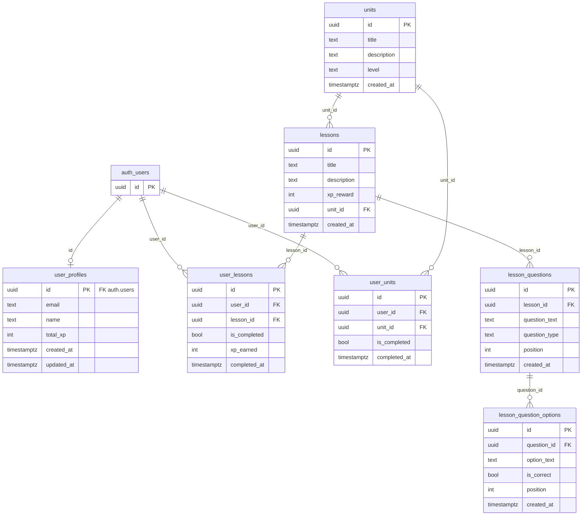

# Relação entre as tabelas (devlingo.sql)

Diagrama apenas das tabelas e suas relações (foreign keys).

## Resumo das relações

| Tabela | Referencia |
|--------|------------|
| **user_profiles** | `id` → `auth.users(id)` |
| **user_lessons** | `user_id` → `auth.users(id)`, `lesson_id` → `lessons(id)` |
| **user_units** | `user_id` → `auth.users(id)`, `unit_id` → `units(id)` |
| **lessons** | `unit_id` → `units(id)` |
| **lesson_questions** | `lesson_id` → `lessons(id)` |
| **lesson_question_options** | `question_id` → `lesson_questions(id)` |

- **auth.users**: tabela do Supabase Auth (não criada pelo script).
- **public**: `units`, `lessons`, `user_profiles`, `user_lessons`, `user_units`, `lesson_questions`, `lesson_question_options`.
